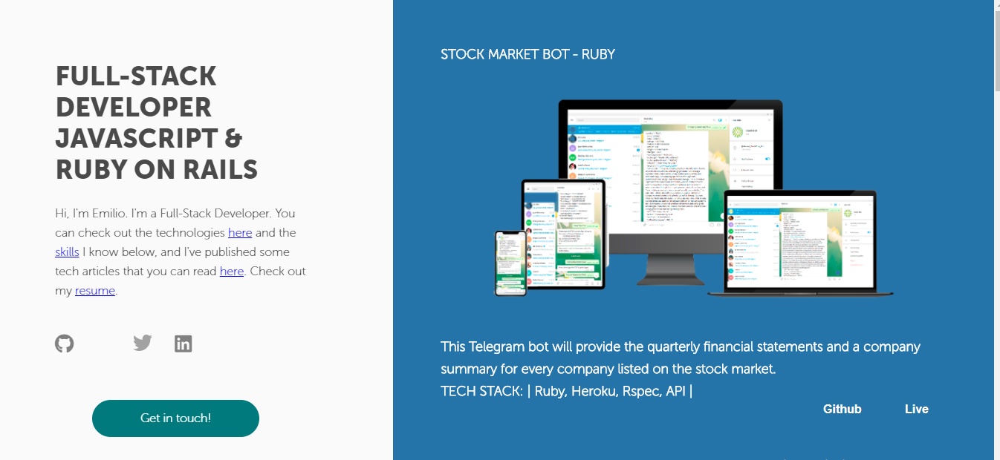

# My-Portfolio
This project is a presentation webpage where I show my tech stack aside from some of the projects I have developed and hosted on my Github profile. It also includes the articles I have written and my resume.

## Built With

- HTML
- CSS
- JavaScript

## Live Demo

- Github Website.

You can click on this [link](https://emiliocm9.github.io/)

## Authors

👤 **Emilio Contreras**

- Github: [@emiliocm9](https://github.com/emiliocm9)
- Twitter: [@emiliocm31](https://twitter.com/emiliocm31)
- Email: [email](emilio.contreras97@gmail.com)
- Linkedin: [@linkedin](https://www.linkedin.com/in/emiliocm31/)

## 🤝 Contributing

Contributions, issues and feature requests are welcome!

Feel free to check the [issues page](issues/).

## Show your support

Give a ⭐️ if you like this project!
